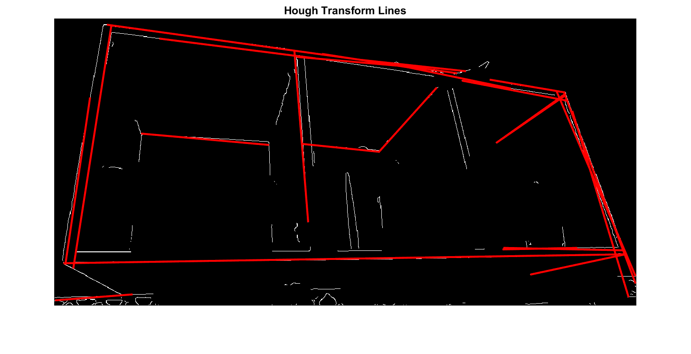
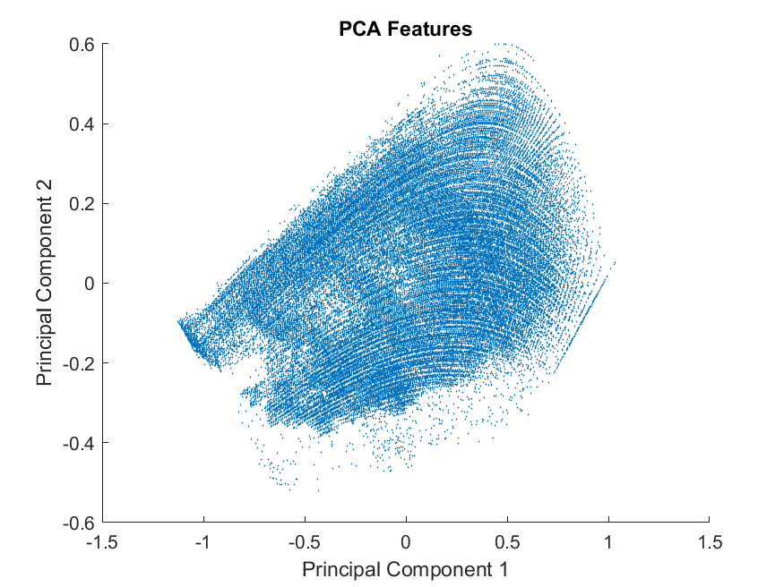
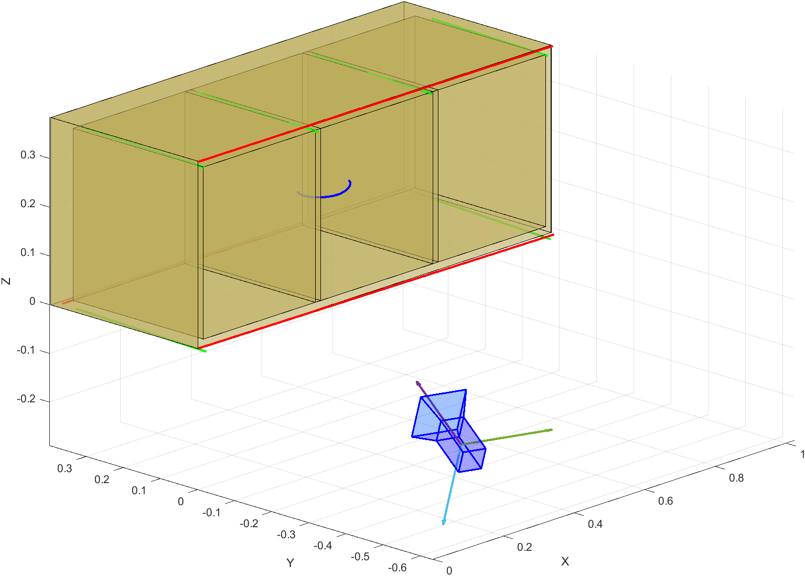
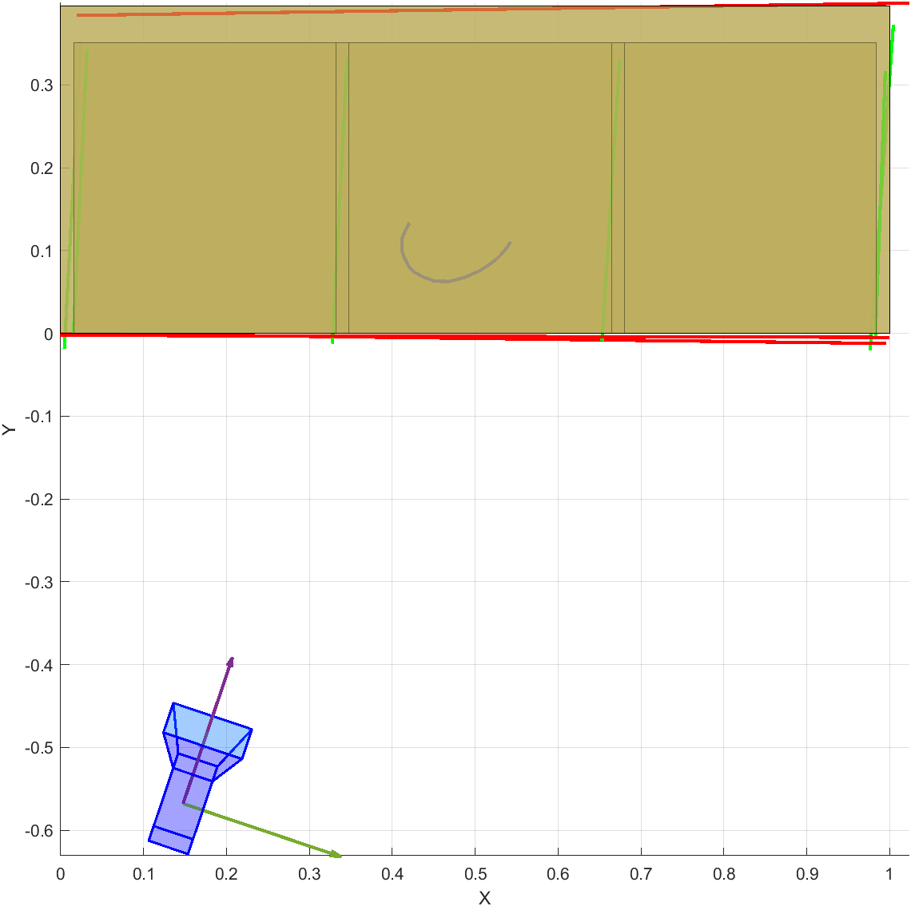

# IACV Homework 2024/25

**Computer Vision homework for reconstructing 3D geometry from a single image**

## Overview

This project implements a complete computer vision pipeline to reconstruct the 3D geometry of a rectangular parallelepiped (cabinet) from a single uncalibrated image. The implementation includes feature extraction, camera calibration, geometric rectification, and 3D model reconstruction.

## Problem Statement

Given a single image of a rectangular cabinet with:

- Known width (1 unit along X-axis)
- Unknown depth (m) and height (h)
- Visible horizontal circumference and planar curve
- Multiple sets of parallel lines in X, Y, and Z directions

**Goal**: Reconstruct the complete 3D geometry and camera parameters.

<div align="center">
  
  <p><em>Input image with extracted features (lines, circumference, and curve S)</em></p>
</div>

## Key Features

### 1. Feature Extraction

- **Line Detection**: Advanced edge detection using PCA on RGB+HSV channels, Canny edge detection, and Hough transform
- **Conic Extraction**: Circumference detection and parameterization
- **Curve Extraction**: Horizontal planar curve identification

### 2. Geometric Reconstruction

- **Vanishing Point Detection**: Robust intersection finding for parallel line sets
- **Metric Rectification**: Euclidean rectification of horizontal planes
- **Camera Calibration**: Intrinsic parameter estimation from vanishing points
- **3D Measurements**: Height and depth calculation from rectified geometry

### 3. 3D Model Generation

- Complete parallelepiped reconstruction
- Camera localization in 3D space
- Multiple view visualization

## Project Structure

```
├── Code/
│   ├── 1-FeatureExtraction/      # Edge detection, line/conic extraction
│   ├── 2.0-ManualLineExtraction/  # Manual line picking tools
│   ├── 2.1-Vanishing_Line_Extraction/  # Vanishing point computation
│   ├── 2.2-Metric_Rectification/  # Geometric rectification
│   ├── 2.3-Intrinsic_Calibration/  # Camera parameter estimation
│   ├── 2.4-Height_Calculation/    # 3D measurements
│   └── 2.5-2.6-Curve_S_and_Camera_Localization/  # Final reconstruction
├── Report/                        # LaTeX technical report
├── Assignment/                    # Original homework specification
└── IACV_Homework_2024_Report_Paolo_Ginefra.pdf
```

## Technical Approach

1. **Feature Extraction**: PCA-based preprocessing, Canny edge detection, Hough line transform
2. **Vanishing Geometry**: SVD-based robust intersection for vanishing points and lines
3. **Rectification**: Homography computation for metric reconstruction
4. **Calibration**: Camera matrix estimation from orthogonal vanishing points
5. **3D Reconstruction**: Height/depth measurement and complete model generation

## Results

### Feature Extraction Pipeline

<div align="center">
  
  
  <p><em>Left: Detected lines using Hough transform. Right: PCA-based feature extraction</em></p>
</div>

### Geometric Rectification

<div align="center">
  
  <p><em>Metric rectification of the horizontal plane</em></p>
</div>

### 3D Model Reconstruction

<div align="center">
  
  
  <p><em>Reconstructed 3D model from different viewpoints</em></p>
</div>

## Requirements

- MATLAB with Computer Vision Toolbox
- Image Processing Toolbox

## Author

**Paolo Ginefra** (ID: 10765882)  
Politecnico di Milano - Image Analysis and Computer Vision Course 2024/25  
Supervisor: Prof. Vincenzo Caglioti

## Documentation

See the complete technical report (`IACV_Homework_2024_Report_Paolo_Ginefra.pdf`) for detailed methodology, mathematical formulations, and results analysis.
